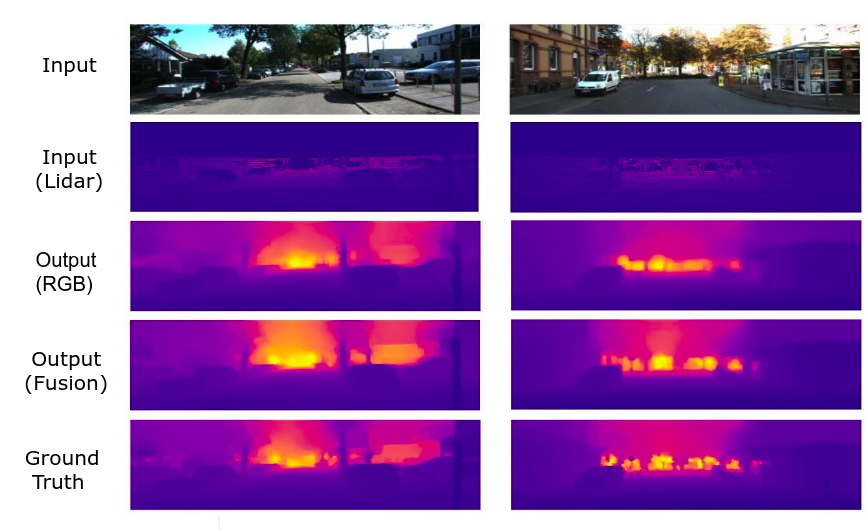
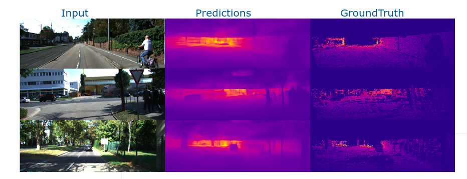
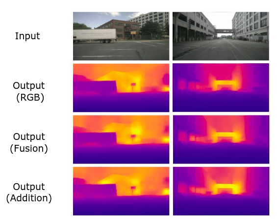

# Multi-Modal-Depth-Estimation
The goal of this work is to incorporate the Radar data with RGB images to showcase its significance on depth estimation task.
The model has been trained on a synthetic dataset that was created using Carla simulator comprising of RGB images, depth images, and Radar point cloud.
We have aslo investigated The impact of Lidar point clouds on depth estimation, when
fused with RGB images using the same model on KITTI and Nuscenes Dataset.
The model consists of encoder-decoder architecture inspired by [High Quality Monocular Depth Estimation via Transfer Learning](https://arxiv.org/abs/1812.11941) but trained with different input modality and loss functions.

# Results
1. KITTI
 

2. KITTI when trained with sparse groundtruth
 

3. Nuscenes
 

4. Synthetic

